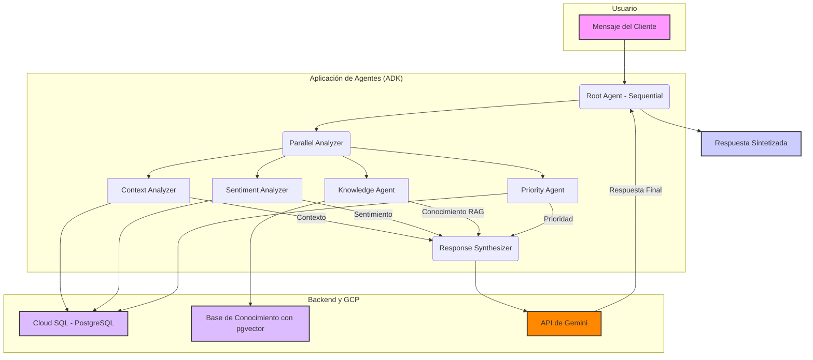

# TFM: Arquitectura de Agentes Autónomos para Servicio al Cliente con GCP y RAG

**Autor**: Diego Fernando Cortes Villa  
**Tutor**: Gustavo Bouso
**Máster**: Máster en Big Data y Ciencia de Datos - VIU

---

## Tabla de Contenidos
1. [Resumen del Proyecto](#resumen-del-proyecto)
2. [Características Principales](#características-principales)
3. [Arquitectura del Sistema](#arquitectura-del-sistema)
4. [Stack Tecnológico](#stack-tecnológico)
5. [Configuración del Entorno de Desarrollo](#configuración-del-entorno-de-desarrollo)
6. [Despliegue de la Infraestructura en GCP](#despliegue-de-la-infraestructura-en-gcp)
7. [Cómo Ejecutar y Probar el Sistema](#cómo-ejecutar-y-probar-el-sistema)
8. [Ejecución de Pruebas Unitarias](#ejecución-de-pruebas-unitarias)
9. [Estructura del Proyecto](#estructura-del-proyecto)
10. [Próximos Pasos](#próximos-pasos)

---

## Resumen del Proyecto

Este proyecto, desarrollado como Trabajo de Fin de Máster (TFM), presenta una arquitectura avanzada de agentes autónomos para la automatización del servicio al cliente. El sistema utiliza un enfoque modular con múltiples agentes especializados que colaboran para proporcionar respuestas personalizadas, contextuales y basadas en conocimiento.

La arquitectura se migró de un prototipo local en memoria a una solución robusta y escalable en **Google Cloud Platform (GCP)**, utilizando **Cloud SQL para PostgreSQL** como base de datos persistente y la extensión **pgvector** para habilitar capacidades de **Generación Aumentada por Recuperación (RAG)**. Esto permite que el sistema no solo gestione el estado de las conversaciones, sino que también "aprenda" y recupere información de una base de conocimiento interna mediante búsqueda semántica.

El sistema está orquestado por un agente raíz que paraleliza el análisis de contexto, sentimiento y conocimiento, para luego sintetizar una respuesta coherente y empática, adaptada al perfil y la necesidad específica de cada cliente.

---

## Características Principales

- **Arquitectura Modular de Agentes**: El sistema se compone de subagentes especializados (análisis de contexto, sentimiento, conocimiento, prioridad y síntesis de respuesta).
- **Procesamiento Paralelo**: Análisis simultáneo de múltiples facetas de la solicitud del cliente para una mayor eficiencia.
- **Memoria Persistente**: Las interacciones con los clientes se almacenan en una base de datos PostgreSQL, permitiendo al sistema tener un "recuerdo" de conversaciones pasadas y mejorar el contexto en futuras sesiones.
- **Generación Aumentada por Recuperación (RAG)**: El `Knowledge Agent` utiliza embeddings vectoriales y `pgvector` para realizar búsquedas semánticas en una base de conocimientos, proporcionando respuestas precisas y basadas en hechos.
- **Infraestructura como Código (IaC)**: El setup del proyecto y la infraestructura en GCP están automatizados mediante scripts de shell, garantizando la reproducibilidad del entorno.
- **Interfaz de Pruebas Interactiva**: Se utiliza la herramienta `adk web` de Google para probar el flujo completo de agentes de forma visual e interactiva.

---

## Arquitectura del Sistema

El flujo de información sigue un patrón de "análisis paralelo seguido de síntesis secuencial":



---

## Stack Tecnológico

- **Backend**: Python 3.12+
- **Framework de Agentes**: Google Agent Development Kit (ADK)
- **Base de Datos**: Google Cloud SQL para PostgreSQL 15 con la extensión `pgvector`.
- **Modelos de Lenguaje**: Google Gemini 2.0 Flash
- **Búsqueda Semántica**: `sentence-transformers`
- **Infraestructura Cloud**: Google Cloud Platform (GCP)
- **Automatización**: Bash Scripts

---

## Configuración del Entorno de Desarrollo

Siga estos pasos para configurar el entorno en una máquina local (Linux/macOS).

### 1. Prerrequisitos
Asegúrese de tener instalados Python (3.9+), Google Cloud SDK y Docker. Puede verificar su entorno con el script:
```bash
python3 scripts/verify_environment.py
```

### 2. Clonar y Preparar el Proyecto
```bash
git clone [URL_DE_TU_REPOSITORIO_GIT]
cd tfm-agentes-autonomos
```

### 3. Ejecutar el Script de Configuración Local
Este script creará el entorno virtual, el `.gitignore` y otros archivos de configuración.
```bash
chmod +x scripts/00_setup_local_env.sh
./scripts/00_setup_local_env.sh
```

### 4. Configurar Variables de Entorno
Cree un archivo `.env` a partir de la plantilla.
```bash
cp .env.example .env
```
Ahora, edite el archivo `.env` y añada su **API Key de Google AI**. El resto de las variables se rellenarán automáticamente con los scripts de infraestructura.

### 5. Instalar Dependencias
Asegúrese de que su entorno virtual está activado y luego instale los paquetes de Python.
```bash
source venv_tfm_agents/bin/activate
pip install -r requirements.txt
```

---

## Despliegue de la Infraestructura en GCP

Estos scripts solo deben ejecutarse **una vez** para crear toda la infraestructura necesaria en la nube.

### 1. Configurar el Proyecto de GCP
Este script configura el proyecto, las APIs y la cuenta de servicio. **Requiere intervención manual para habilitar la facturación.**```bash
./scripts/01_setup_gcp_project.sh
```

### 2. Crear la Instancia de Cloud SQL
Este script crea la instancia de PostgreSQL, la base de datos, los usuarios y actualiza el archivo `.env` con las contraseñas generadas.
```bash
./scripts/02_setup_cloudsql.sh
```

### 3. Inicializar la Base de Datos
Este script inicia el Cloud SQL Auth Proxy, habilita `pgvector`, crea todas las tablas e inserta los datos de ejemplo.
```bash
./scripts/03_run_proxy_and_init_db.sh
```
*Nota: Este script dejará el proxy en ejecución y se detendrá automáticamente al finalizar. Para el desarrollo diario, use `connect_proxy.sh`.*

---

## Cómo Ejecutar y Probar el Sistema

Para el desarrollo y las pruebas diarias, siga este flujo de trabajo con dos terminales.

### Terminal 1: Iniciar el Proxy
```bash
# Activar entorno virtual
source venv_tfm_agents/bin/activate

# Iniciar la conexión segura y dejarla corriendo
./scripts/connect_proxy.sh
```
**Deje esta terminal abierta.** Es su túnel a la base de datos.

### Terminal 2: Iniciar el Servidor Web del ADK
```bash
# Activar entorno virtual
source venv_tfm_agents/bin/activate

# Iniciar la interfaz de pruebas
adk web main:root_agent
```

### Navegador Web
Abra la URL `http://127.0.0.1:8000` en su navegador. Use la interfaz de chat para interactuar con el agente. La pestaña "Agent Trajectory" mostrará el flujo de ejecución completo.

---

## Ejecución de Pruebas Unitarias

Para verificar componentes específicos del sistema, puede ejecutar pruebas individuales. Asegúrese de que el **Cloud SQL Proxy esté activo** (Terminal 1) antes de ejecutar las pruebas.

### Probar Conexión y pgvector
```bash
python tests/test_vectors.py
```

### Probar Herramienta de Contexto
```bash
python tests/test_context_analyzer.py
```

### Probar Persistencia de Memoria
```bash
python tests/test_persistence.py
```

---

## Estructura del Proyecto

```
.
├── config/                 # Carga y gestión de configuración centralizada (.env)
├── customer_service_agent_app/ # Código fuente principal de la aplicación
│   ├── repository/         # Capa de acceso a la base de datos
│   └── subagents/          # Módulos para cada agente especializado
├── scripts/                # Scripts de automatización para setup y conexión
├── tests/                  # Pruebas unitarias y de integración
├── .env                    # Variables de entorno locales (NO EN GIT)
├── main.py                 # Punto de entrada para el servidor ADK
└── ...
```

---

## Próximos Pasos

- **Añadir más artículos** a la base de conocimiento para mejorar la capacidad del RAG.
- **Implementar una lógica de reglas más dinámica** en el `Priority Agent` para leerlas desde la base de datos.
- **Contenerizar la aplicación** con el `Dockerfile` y desplegarla en **Cloud Run**.
- **Configurar CI/CD** con Cloud Build para automatizar las pruebas y los despliegues.

---

## Licencia

Este proyecto está bajo la Licencia MIT.