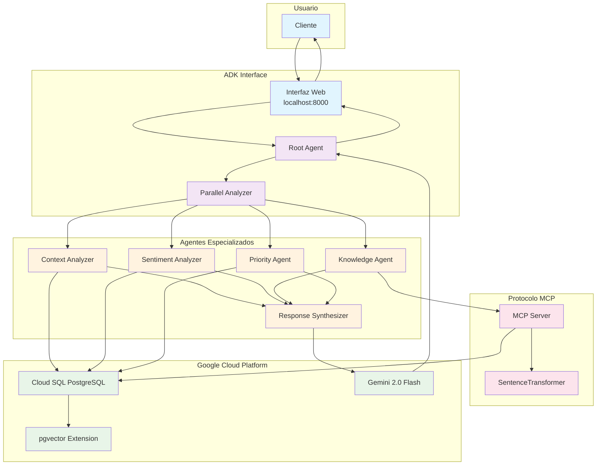

# Arquitectura de Agentes Autónomos para Servicio al Cliente

**Trabajo de Fin de Máster - VIU**  
**Autor**: Diego Fernando Cortes Villa  
**Tutor**: Gustavo Martín Bouso

---

## Resumen del Proyecto

Sistema modular de agentes autónomos que automatiza el servicio al cliente usando IA generativa. Implementa una arquitectura jerárquica con agentes especializados que colaboran para proporcionar respuestas personalizadas, contextuales y basadas en conocimiento.

### Características Principales

- **Orquestación Inteligente**: Root Agent coordina agentes especializados con procesamiento paralelo
- **Gestión de Contexto**: Preservación completa del historial conversacional en PostgreSQL
- **RAG Semántico**: Búsqueda inteligente en base de conocimiento usando embeddings vectoriales
- **Protocolo MCP**: Comunicación estandarizada entre agentes y herramientas externas
- **Infraestructura Cloud**: Desplegado en Google Cloud Platform con Cloud SQL

---

## Arquitectura del Sistema



### Flujo de Procesamiento

1. **Usuario** envía consulta a través de la interfaz web
2. **Root Agent** coordina el proceso y activa *Parallel Analyzer*
3. **Análisis Paralelo** ejecuta simultáneamente:
   - **Context Analyzer**: Extrae información del cliente y historial
   - **Sentiment Analyzer**: Detecta emociones para respuesta empática
   - **Knowledge Agent**: Búsqueda RAG en base de conocimiento via MCP
   - **Priority Agent**: Clasifica urgencia y determina escalamiento
4. **Response Synthesizer** consolida resultados usando *Gemini*
5. **Respuesta Final** personalizada y contextualizada al usuario

---

## Stack Tecnológico

- **Framework**: Google Agent Development Kit (ADK)
- **Protocolo**: Model Context Protocol (MCP)
- **Base de Datos**: Google Cloud SQL PostgreSQL 15 + pgvector
- **IA**: Google Gemini 2.0 Flash + SentenceTransformers
- **Cloud**: Google Cloud Platform
- **Lenguaje**: Python 3.12+

---

## 🚀 Instalación (Primera Vez)

### Prerrequisitos
- Python 3.12+
- Google Cloud SDK
- Git

### 1. Configuración Local
```bash
# Clonar repositorio
git clone [URL_REPOSITORIO]
cd tfm-agentes-autonomos

# Configurar entorno
./scripts/00_setup_local_env.sh
source venv_tfm_agents/bin/activate

# Instalar dependencias
pip install -r requirements.txt
pip install --upgrade google-adk

# Configurar variables de entorno
cp .env.example .env
# Editar .env y añadir tu GOOGLE_API_KEY
```

### 2. Infraestructura GCP (Solo primera vez)
```bash
# Configurar proyecto GCP
./scripts/01_setup_gcp_project.sh

# Crear instancia Cloud SQL
./scripts/02_setup_cloudsql.sh

# Inicializar base de datos
./scripts/03_run_proxy_and_init_db.sh
```

---

## 📱 Uso Diario

### Iniciar el Sistema

**Terminal 1: Proxy de Base de Datos**
```bash
source venv_tfm_agents/bin/activate
./scripts/connect_proxy.sh
```
*Mantener ejecutándose durante toda la sesión*

**Terminal 2: Interfaz ADK**
```bash
source venv_tfm_agents/bin/activate
adk web customer_service_agent_app
```

**Navegador**: http://127.0.0.1:8000

### Ejemplos de Prueba

**Escalamiento Crítico**:
```
¡URGENTE! El servidor está caído y no puedo procesar pedidos
```

**Búsqueda Técnica**:
```
problema de conexión base de datos postgresql timeout
```

**Consulta con Contexto**:
```
Cliente CUST_003 reporta error crítico: fallo de conexión a base de datos en sistema de facturación
```

**Seguimiento**:
```
Soy CUST_003, ¿hay novedades sobre mi caso de ayer?
```

### Interpretación de Resultados

En la pestaña **"Agent Trajectory"** verás el flujo completo:
- Root Agent coordinando el proceso
- Parallel Analyzer distribuyendo tareas
- Cada agente especializado ejecutando su función
- Knowledge Agent realizando búsquedas RAG reales
- Response Synthesizer generando respuesta final

---

## Estructura del Proyecto

```
tfm-agentes-autonomos/
├── config/                        # Configuración centralizada
├── customer_service_agent_app/     # Código fuente principal
│   ├── agent.py                       # Aplicación principal ADK
│   ├── repository/                 # Acceso a datos
│   │   ├── customer_repository.py     # Gestión de clientes
│   │   ├── knowledge_repository.py    # Base de conocimiento + RAG
│   │   ├── priority_repository.py     # Reglas de priorización
│   │   └── sentiment_repository.py    # Análisis de sentimientos
│   └── subagents/                  # Agentes especializados
│       ├── context_analyzer/       # Análisis de contexto
│       ├── knowledge_agent/        # Búsqueda RAG con MCP
│       ├── priority_agent/         # Clasificación de urgencia
│       ├── response_synthesizer/   # Síntesis de respuesta
│       └── sentiment_agent/        # Análisis emocional
├── scripts/                       # Automatización y setup
├── tests/                         # Pruebas unitarias
├── knowledge_mcp_server_simple.py    # Servidor MCP pruebas
├── knowledge_mcp_server_standalone.py # Servidor MCP producción
└── requirements.txt               # Dependencias Python
```

---

## ⚠️ Troubleshooting

### Problema: "Timed out while waiting for response"
**Solución**: Verificar que el Cloud SQL Proxy esté ejecutándose
```bash
ps aux | grep cloud_sql_proxy
```

### Problema: Knowledge Agent no encuentra información
**Solución**: Usar servidor MCP completo
```python
# En customer_service_agent_app/subagents/knowledge_agent/tools.py
args=["knowledge_mcp_server_standalone.py"]  # En lugar de simple.py
```

### Problema: Error de conexión a base de datos
**Solución**: Verificar variables de entorno
```bash
python -c "
import os
from dotenv import load_dotenv
load_dotenv()
print('DB_USER:', os.getenv('DB_USER'))
print('DB_NAME:', os.getenv('DB_NAME'))
"
```

---

## 📝 Pruebas del Sistema

### Probar Componentes Individuales
```bash
# Verificar conexión y pgvector
python tests/test_vectors.py

# Probar análisis de contexto
python tests/test_context_analyzer.py

# Probar flujo completo
python tests/test_full_agent_flow.py
```

### Probar Servidor MCP
```bash
# Servidor completo con BD
python knowledge_mcp_server_standalone.py

# Servidor simple para pruebas
python knowledge_mcp_server_simple.py
```

---

## Resultados Esperados

- **Tiempo de respuesta**: 3-5 segundos
- **Contexto preservado**: 100% entre agentes
- **Búsqueda semántica**: Encuentra información relevante aunque no coincidan palabras exactas
- **Escalamiento automático**: Detecta urgencia y prioriza automáticamente
- **Personalización**: Adapta respuesta al perfil del cliente y sentimiento detectado

---

##  Licencia

MIT License - Uso académico y comercial permitido con atribución.

---

**© 2025 Diego Fernando Cortes Villa - Universidad Internacional de Valencia**